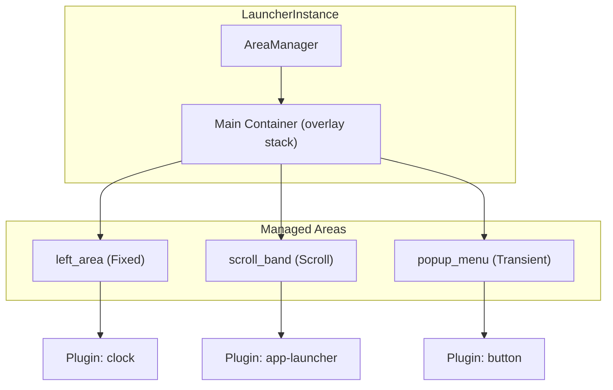

# Area System

The area system manages the layout of the launcher. Each instance has an `AreaManager` that tracks which areas are visible, handles transitions, and manages
transient (auto-closing) areas.

## Area Types

| Type       | Description                       | Key Properties                    |
|------------|-----------------------------------|-----------------------------------|
| **Fixed**  | Static area with fixed width      | `width`, `width_percent`, `align` |
| **Scroll** | Scrollable area with drag gesture | `hexpand`, `vexpand`, `spacing`   |

## Area Configuration

Areas are defined in `config.toml`:

```toml
areas = ["left_area", "scroll_band", "right_area"]

[left_area]
area_type = "fixed"
width = 200
plugins = [{ id = "clock_widget", path = "target/release/libsmearor_clock_widget.so" }]

[scroll_band]
area_type = "scroll"
plugins = [{ id = "app_launcher", path = "target/release/libsmearor_app_launcher_widget.so" }]
```

## Area Manager Architecture



## Transient Areas

Transient areas auto-close when:

- The user clicks outside the area
- The escape key is pressed (if `close_on_escape` is enabled)
- An `area.close` message is received with the area's ID

## Nested Sub-Menus

The area system supports unlimited nesting depth. Opening a sub-menu pushes the current area onto a stack; closing pops it.

## Transition Animations

| Animation    | Description       |
|--------------|-------------------|
| `None`       | No animation      |
| `Fade`       | Fade in/out       |
| `SlideLeft`  | Slide from left   |
| `SlideRight` | Slide from right  |
| `SlideUp`    | Slide from top    |
| `SlideDown`  | Slide from bottom |
| `Pop`        | Pop in/out        |
| `Scale`      | Scale in/out      |

## Dynamic Area API

Areas can be managed at runtime via the message broker:

- `area.open` — Open an area by ID (with optional target instance)
- `area.close` — Close an area by ID
- `area.toggle` — Toggle an area's visibility

Cross-instance area addressing uses the `instance_id:area_id` syntax in the topic (e.g. `area.side2:submenu.open`).

## Backend Abstraction

The `AreaManager` is generic over a backend `B: AreaBackend`:

- **`GtkBackend`** — Real `gtk4` widgets, overlays, and containers
- **`HeadlessBackend`** — No-op types that don't require GTK

This allows the same area logic to work for both GTK and headless instances.

See [Dynamic Area Management](../features/dynamic-areas.md) for the feature perspective, and [Area Configuration](../configuration/area-config.md) for
configuration details.
