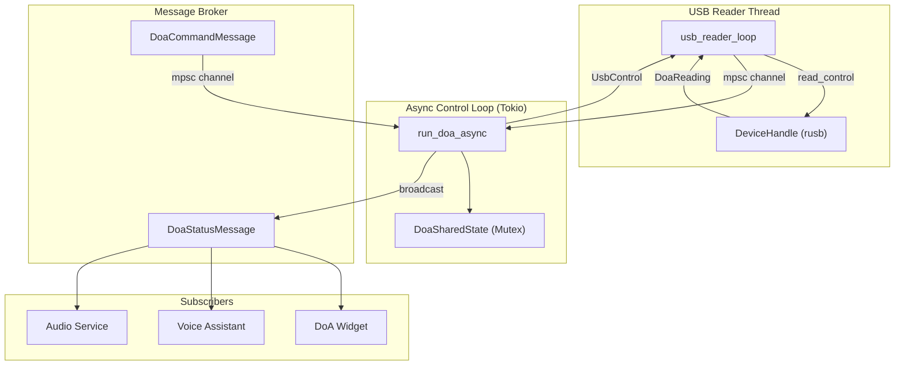

# DoA Service Architecture

The DoA service integrates with the ReSpeaker XVF3800 USB 4-Mic Array to provide real-time direction-of-arrival detection and hardware VAD (Voice Activity
Detection).

## Architecture



## USB Reader Thread

The USB reader runs on a dedicated OS thread to avoid blocking the async runtime with synchronous `rusb` control transfers.

### Read Cycle

1. Check for pending control commands (`Pause`, `Resume`, `SetInterval`, `Reconnect`)
2. If paused, sleep for the poll interval and skip reading
3. If connected, perform a single USB control transfer reading both angle and VAD
4. On success, send `DoaReading::Reading` to the async loop
5. On error, classify and handle (see Error Handling below)
6. Sleep for the remaining poll interval

### USB Control Transfer

The XVF3800 uses a resource/command ID protocol:

- `wValue = 0x80 | cmdid` (high bit set for reads)
- `wIndex = resid` (resource ID)
- Response: status byte + angle (uint16 LE) + VAD (uint16 LE)

Both angle and VAD are read in a **single control transfer** for efficiency.

### Transfer Timeout

The USB transfer timeout is computed as half the poll interval, clamped to [20, 100] ms:

```rust
pub fn usb_transfer_timeout(poll_interval_ms: u64) -> Duration {
    Duration::from_millis((poll_interval_ms / 2).clamp(20, 100))
}
```

This ensures two consecutive stalled transfers cannot block the USB thread longer than one poll cycle.

### Error Handling

USB errors are classified into three categories:

| Category            | Errors                       | Action                                                   |
|---------------------|------------------------------|----------------------------------------------------------|
| Physical disconnect | `NoDevice`, `NotFound`, `Io` | Drop handle, attempt reconnection, log once at `warn!`   |
| Transient           | `Busy`, `Timeout`, `Pipe`    | Keep handle, exponential backoff, suppress repeated logs |
| Unexpected          | All others                   | Drop handle, full reconnection, log at `error!`          |

## Async Control Loop

The async control loop (`run_doa_async`) runs on the Tokio runtime and processes:

1. **Commands** (`DoaCommandMessage`): Reconnect, Pause, Resume, SetPollInterval
2. **Readings** (`DoaReading`): Apply calibration, update shared state, broadcast status

### Calibration

The calibrated angle is computed from the raw angle, rotation offset, and ceiling mode:

```rust
pub fn compute_calibrated_angle(angle: u16, rotation_offset: i16, ceiling_mode: bool) -> u16 {
    let raw_angle = if ceiling_mode { (360 - angle as i16).rem_euclid(360) } else { angle as i16 };
    (raw_angle + rotation_offset).rem_euclid(360) as u16
}
```

- **Ceiling mode**: Mirrors the angle (360 - angle) for ceiling-mounted installations
- **Rotation offset**: Applies a configurable offset to align with physical table orientation

### Change Detection

Status messages are only broadcast when the angle or speech detection state changes, reducing unnecessary message broker traffic.

## MCP Integration

### Tools

| Tool                    | Arguments | Description                                     |
|-------------------------|-----------|-------------------------------------------------|
| `doa_get_direction`     | None      | Returns current direction, angle, and VAD state |
| `doa_set_poll_interval` | `ms: u64` | Changes the USB poll interval (minimum 50 ms)   |
| `doa_reconnect`         | None      | Forces USB device reconnection                  |

### Resources

| Resource       | Description                                         |
|----------------|-----------------------------------------------------|
| `doa://status` | Current DoA status as JSON (`DoaDirectionResponse`) |

## Voice Assistant Integration

The Voice Assistant service subscribes to `DoaStatusMessage` and uses the hardware VAD flag for low-latency listening mode activation.

### VAD Edge Detection

The VAD transition is classified using `VadSpeakingState` → `VadTransition`:

| Previous | Current | Transition       | Action                                    |
|----------|---------|------------------|-------------------------------------------|
| false    | true    | RisingEdge       | Record onset timestamp, cancel grace exit |
| true     | true    | ContinuousSpeech | Check min_speech_duration_ms, activate    |
| true     | false   | FallingEdge      | Schedule grace period exit                |
| false    | false   | NoChange         | No action                                 |

### TTS-Mute-Window

When AEC mirroring is not configured, VAD edge detection is suppressed during TTS playback to prevent self-triggering from the speaker output. The
`previous_speech_detected` and `vad_onset_timestamp` state are reset during TTS.

### Configuration

```toml
[voice_assistant.doa_vad]
enabled = true
grace_period_ms = 400
min_speech_duration_ms = 100
skip_wake_word_on_vad = true
aec_mirroring_enabled = false
tts_mute_holdover_ms = 300
```

## Audio Service Integration

The Audio service subscribes to `DoaStatusMessage` and uses the VAD flag for volume ducking during speech.

### Ducking Logic

The same VAD edge detection logic is used, with ducking-specific actions:

| Transition       | Action                                             |
|------------------|----------------------------------------------------|
| RisingEdge       | Record onset timestamp, cancel pending restore     |
| ContinuousSpeech | Duck volume to `ducking_volume` after min duration |
| FallingEdge      | Schedule grace period restore with fade ramp       |

### Configuration

```toml
[audio]
ducking_enabled = true
ducking_volume = 0.2
ducking_grace_period_ms = 500
min_speech_duration_ms = 100
fade_ramp_ms = 500
duck_during_tts = true
```
