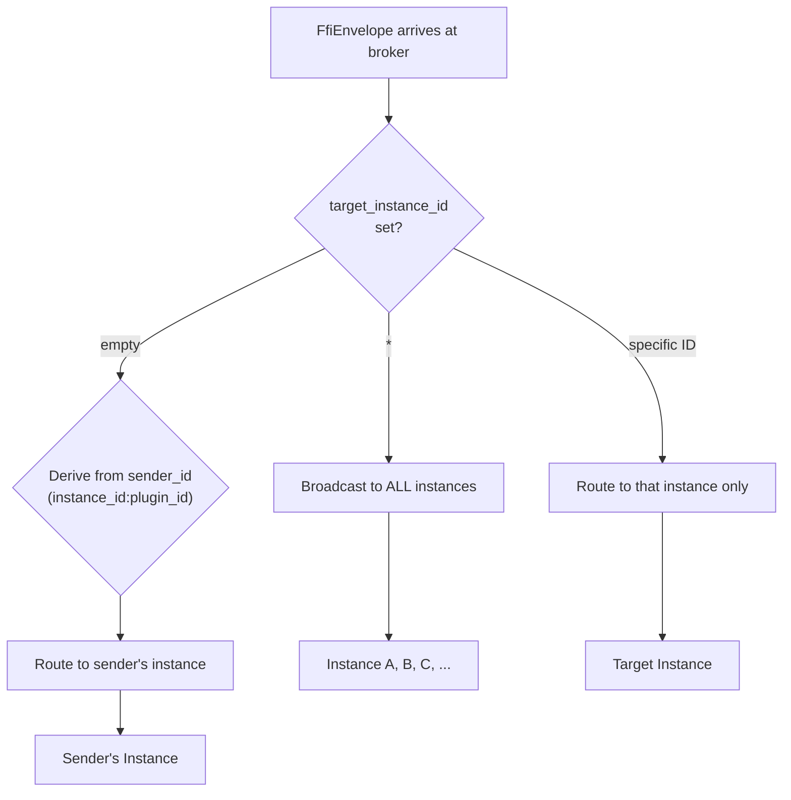

# Inter-Instance Events

Multiple launcher instances can run simultaneously in a single host process. They communicate through the central message broker using `target_instance_id`
routing.

## Routing Logic



## Cross-Instance Area Addressing

A plugin can open an area in a different instance by using the `instance_id:area_id` syntax in the topic:

```
topic: area.side2:submenu.open
```

The broker detects the colon in the area ID, extracts the target instance, rewrites the topic to `area.submenu.open`, and routes the message to instance
`side2`.

## Service Broadcasting

Services broadcast status updates to all instances by setting `target_instance_id = "*"`:

```
topic: service.audio.status
target_instance_id: *
```

All instances receive the message and their plugins can react accordingly.

## Workspace Events

Compositor events (workspace changes, monitor changes, lifecycle events) are broadcast to all instances. Each instance can react independently — for example, by
switching its layout profile or re-rendering MacroPad buttons.

## Instance Lifecycle Messages

The broker handles special topics for dynamic instance management:

| Topic                  | Description                                     |
|------------------------|-------------------------------------------------|
| `core.instance.load`   | Load a new instance with a config path and type |
| `core.instance.stop`   | Stop and unload an instance                     |
| `core.instance.reload` | Reload an instance with a new config            |

These messages are processed by `LauncherHost::route_message()` and allow runtime instance management without restarting the host.

See [Multi-Instance](../features/multi-instance.md) for the feature perspective.
