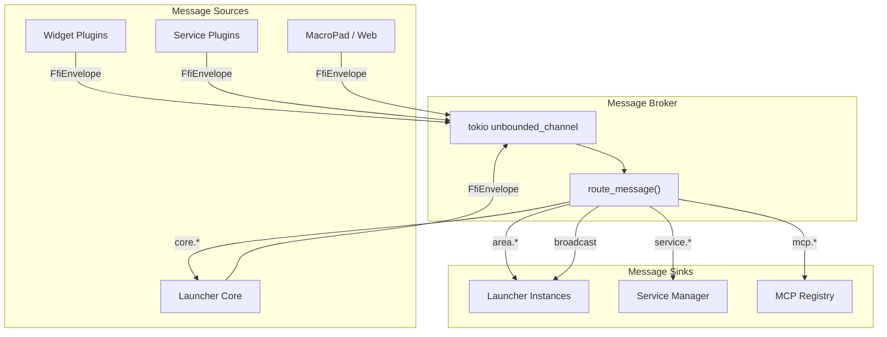

# Message Broker

The message broker is the central communication hub of the launcher. It routes `FfiEnvelope` messages between plugins, services, and instances based on topic
and `target_instance_id`.

## Architecture



## FfiEnvelope

Every message is wrapped in an `FfiEnvelope`:

```rust
pub struct FfiEnvelope {
    pub sender_id: String,           // "instance_id:plugin_id"
    pub target_instance_id: String,  // "", "*", or specific instance
    pub topic: String,               // e.g. "service.audio.command"
    pub type_id: u64,                // Stable type ID for downcasting
    pub payload: *mut c_void,        // Boxed message payload
    pub destroy_payload: Option<extern "C" fn(*mut c_void)>,
    pub clone_payload: Option<extern "C" fn(*mut c_void) -> *mut c_void>,
}
```

## Topic Routing

The broker routes messages based on topic prefixes:

| Topic Pattern      | Route To                               | Example                         |
|--------------------|----------------------------------------|---------------------------------|
| `area.*`           | Instance's `AreaManager`               | `area.open`, `area.close`       |
| `service.*`        | `ServiceManager` → specific service    | `service.audio.command`         |
| `service.*.status` | Broadcast to all instances             | `service.audio.status`          |
| `mcp.register.*`   | `McpRegistry` + voice_assistant        | `mcp.register.tool`             |
| `mcp.invoke.*`     | Owning plugin/service                  | `mcp.invoke.tool`               |
| `mcp.*.response`   | `McpResponseTracker` + voice_assistant | `mcp.tool.response`             |
| `core.instance.*`  | `LauncherHost` instance management     | `core.instance.load`            |
| `core.close`       | Close the instance's window            | —                               |
| `compositor::*`    | Broadcast to all plugins               | `compositor::workspace_changed` |
| `macropad.input`   | Route to matching instance             | —                               |
| `widget.update`    | Re-render single widget                | —                               |

## JSON String Conversion

Generic widgets (e.g. `button`) send plain JSON string payloads. The host uses a `JsonConverterRegistry` to convert these strings into typed messages based on
the topic. Each model crate registers its converters via `register_json_converters(context)`.

## Rate Limiting

Command topics (ending in `.command`) are rate-limited to 30ms per topic per instance to protect the broker from burst overload.

## Message Handler Trait

Plugins implement `MessageHandler<T>` to receive typed messages:

```rust
pub trait MessageHandler<T: Clone> {
    fn handle_message(&self, message: T, sender_id: &str);
    fn handle_envelope_message(&self, envelope: &FfiEnvelope);
}
```

The `handle_envelope_message` method downcasts the raw payload pointer to `T` using the `type_id` and calls `handle_message`.

See [Message System](../plugin-api/message-system.md) for how to use the messaging API in plugins.
