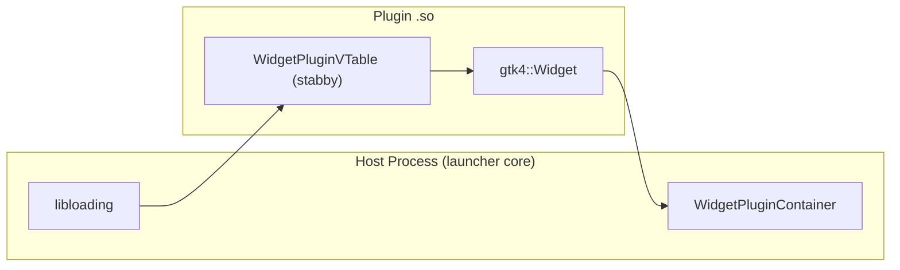

# Native GTK Widgets via FFI

One of the key architectural decisions is using **native GTK-4 widgets** across an FFI boundary. This gives the launcher full control over rendering, input
handling, and CSS styling — unlike web-based approaches.

## The Challenge

GTK widgets (`gtk4::Widget`) are not ABI-stable. Passing them across a dynamic library boundary risks memory corruption if the host and plugin were compiled
with different GTK versions or compiler settings.

## The Solution: `stabby`

The launcher uses [`stabby`](https://github.com/ZettaScaleLabs/stabby) to provide ABI-stable trait objects. `stabby` generates C-ABI-compatible VTables that are
stable across compiler versions and library boundaries.



## Widget Plugin Container

The host holds a `WidgetPluginContainer` — a `stabby`-compatible struct that wraps the plugin's VTable:

```rust
pub struct WidgetPluginContainer {
    pub vtable: StabbyVTable<WidgetPluginVTable>,
    pub data: stabby::DynRef,
}
```

The host calls methods through the VTable:

- `constructor` — Creates the plugin instance with config and context
- `on_message` — Delivers `FfiEnvelope` messages
- `meta` — Returns plugin metadata
- `start` — Called after loading
- `render_graphic` — Optional: render to RGBA pixels (headless)
- `render_html` — Optional: render to HTML (web)

## Memory Safety

- Plugins allocate their own memory and pass it via raw pointers
- `FfiEnvelope` carries `destroy_payload` and `clone_payload` function pointers
- The host calls `destroy_payload` after all handlers have processed the message
- `clone_payload` is used when the broker needs to duplicate an envelope for multiple recipients
- On unload, the library is **leaked** (not unloaded) to avoid freeing code that async tasks may still be executing

## Widget Builder

Widget plugins implement `WidgetBuilder` to construct their GTK widget:

```rust
pub trait WidgetBuilder {
    fn build_widget(&self, rotation: Rotation) -> gtk4::Widget;
}
```

The host calls this during area setup and places the returned widget into the area container.

## FFI Core Context

Each plugin receives `FfiCoreContext` at construction, providing:

- `MessageBrokerHandle` — `send()` to publish messages
- `PluginExecutor` — `spawn()` to run async futures on the host's tokio runtime
- `register_json_converter` — Register topic→type deserializers

See [Plugin System](./plugin-system.md) for the full plugin lifecycle, and [Developing Widget Plugins](../plugin-api/widget-plugin.md) for a how-to guide.
