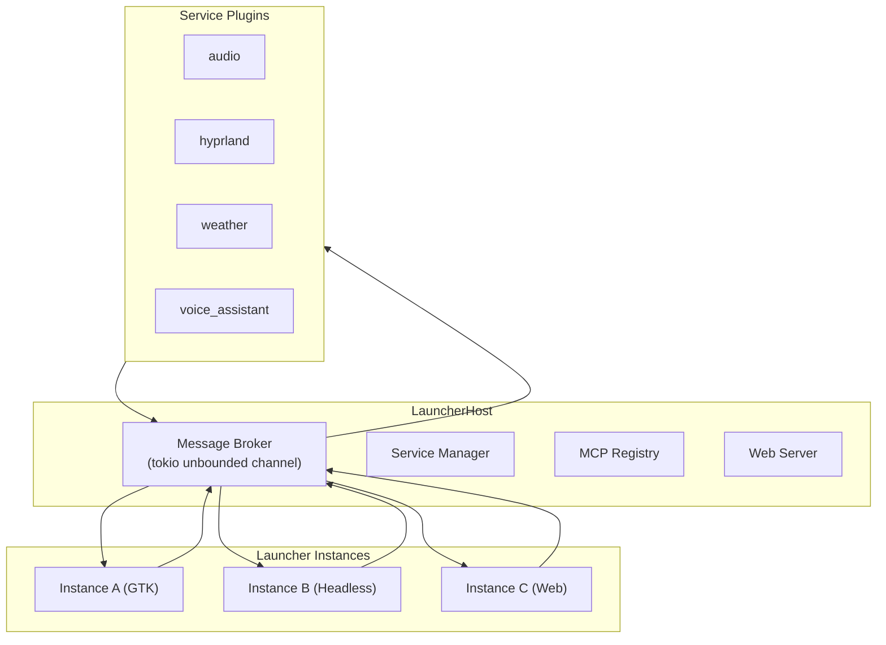
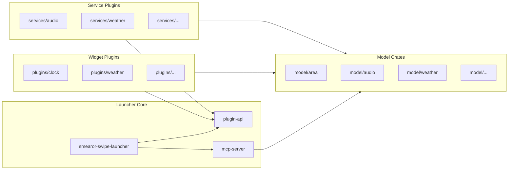
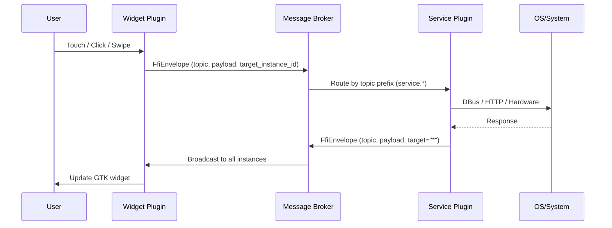

# Architecture Overview

The Smearor Swipe Launcher is built as a single-process host that manages multiple launcher instances, each with its own plugins, areas, and window. A central
message broker routes events between instances and services.

## High-Level Architecture

## Key Components

| Component          | Location                                          | Description                                                                   |
|--------------------|---------------------------------------------------|-------------------------------------------------------------------------------|
| `LauncherHost`     | `smearor-swipe-launcher/src/host/mod.rs`          | Owns the GTK app, service manager, broker channel, instance map, MCP registry |
| `LauncherInstance` | `smearor-swipe-launcher/src/instance/`            | Per-window instance with its own `PluginManager` and `AreaManager`            |
| `PluginManager`    | `smearor-swipe-launcher/src/plugin/manager.rs`    | Loads/unloads widget plugins (`.so` files) per instance                       |
| `ServiceManager`   | `smearor-swipe-launcher/src/service/manager.rs`   | Loads/unloads service plugins (shared across all instances)                   |
| `AreaManager`      | `smearor-swipe-launcher/src/area/area_manager.rs` | Manages dynamic areas (fixed, scroll, transient) per instance                 |
| Message Broker     | `smearor-swipe-launcher/src/context.rs`           | Routes `FfiEnvelope` messages by topic and `target_instance_id`               |
| MCP Registry       | `smearor-swipe-launcher/src/host/mod.rs`          | Tracks tools, resources, and prompts registered by plugins                    |

## Crate Organization

## Message Flow

## Build and Loading

1. The workspace is compiled with `cargo build --release`
2. Each plugin crate produces a `.so` dynamic library in `target/release/`
3. The launcher reads `config.toml` and loads plugins via `libloading`
4. Services are loaded once and shared across all instances
5. Widget plugins are loaded per-instance with namespaced IDs (`instance_id:plugin_id`)

See the individual architecture chapters for deeper dives:

- [Plugin System](./plugin-system.md)
- [Service-Oriented Architecture](./service-architecture.md)
- [Area System](./area-system.md)
- [Renderer Systems](./renderer-systems.md)
- [Message Broker](./message-broker.md)
- [Instance Types](./instance-types.md)
