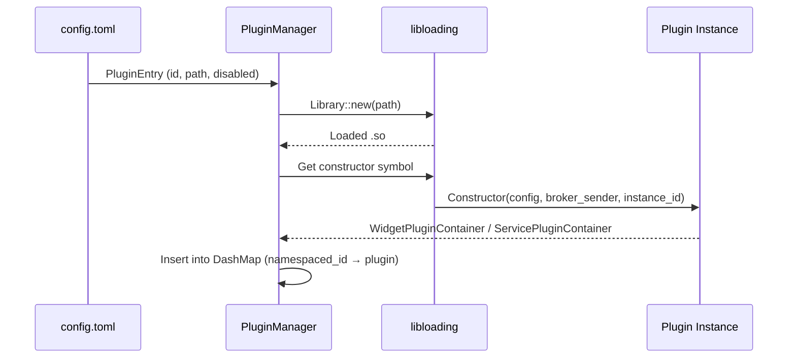

# Plugin System

The plugin system is the core extensibility mechanism of the launcher. Plugins are compiled as dynamic libraries (`.so` files) and loaded at runtime via
`libloading`. ABI stability is guaranteed by `stabby`, which provides stable trait objects across the FFI boundary.

## Plugin Types

There are two types of plugins:

- **Widget Plugins** — Provide visual GTK widgets, handle user input, send messages. Located in `plugins/`. Use the `widget_plugin!` macro.
- **Service Plugins** — Implement business logic without UI, communicate with the system. Located in `services/`. Use the `service_plugin!` macro.

Both types share the same message infrastructure and can register MCP tools, resources, and prompts.

## Loading Flow



## Plugin VTables

Each plugin type exposes a C-ABI VTable via `stabby`:

### Widget Plugin VTable

```rust
pub struct WidgetPluginVTable {
    pub constructor: WidgetPluginConstructor,
    pub destroy: extern "C" fn(WidgetPluginContainer),
    pub on_message: extern "C" fn(&WidgetPluginContainer, &FfiEnvelope),
    pub meta: extern "C" fn(&WidgetPluginContainer) -> PluginMetaRaw,
    pub start: extern "C" fn(&WidgetPluginContainer),
    pub render_graphic: Option<extern "C" fn(&WidgetPluginContainer, u32, u32) -> FfiGraphic>,
    pub render_html: Option<extern "C" fn(&WidgetPluginContainer, &str, &str) -> FfiHtmlString>,
}
```

### Service Plugin VTable

```rust
pub struct ServicePluginVTable {
    pub constructor: ServicePluginConstructor,
    pub destroy: extern "C" fn(ServicePluginContainer),
    pub on_message: extern "C" fn(&ServicePluginContainer, &FfiEnvelope),
    pub meta: extern "C" fn(&ServicePluginContainer) -> PluginMetaRaw,
    pub start: extern "C" fn(&ServicePluginContainer),
}
```

## Plugin Identification

Plugins are identified by a **namespaced ID**: `{instance_id}:{plugin_id}`. This allows the same plugin crate to be loaded in multiple instances without
conflicts. When `instance_id` is empty, the raw `plugin_id` is used.

## Plugin Lifecycle

1. **Load** — `PluginManager::load_plugin()` opens the `.so`, calls the constructor, passes `FfiCoreContext` (broker handle + executor)
2. **Start** — `plugin.start()` is called after insertion
3. **Message Handling** — `plugin.on_message(envelope)` routes incoming `FfiEnvelope` messages
4. **Unload** — `plugin.destroy()` is called, then the library is leaked (to avoid unloading code that async tasks may still be executing)

## FFI Core Context

Each plugin receives an `FfiCoreContext` at construction time:

```rust
pub struct FfiCoreContext {
    pub broker: MessageBrokerHandle,
    pub executor: PluginExecutor,
    pub register_json_converter: Option<RegisterJsonConverterFn>,
}
```

- **`MessageBrokerHandle`** — `send()` function to publish messages to the broker
- **`PluginExecutor`** — `spawn()` function to run async tasks on the host's tokio runtime
- **`register_json_converter`** — Registers a topic→type deserializer for JSON string payloads

## Required Traits

Widget plugins must implement:

- `MessageHandler<T>` — Handle incoming typed messages
- `MessageBroadcaster` — Send messages to the broker
- `PluginMetaGetter` — Return `PluginMeta` (id, name, version)
- `AsRef<Option<FfiCoreContext>>` — Provide access to the core context

Service plugins implement the same set of traits.

See [Developing Widget Plugins](../plugin-api/widget-plugin.md) and [Developing Service Plugins](../plugin-api/service-plugin.md) for how-to guides.
