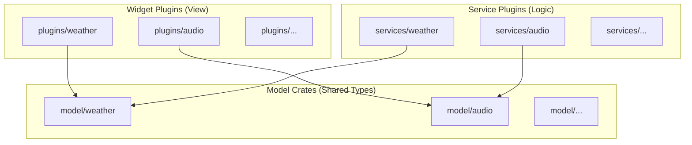
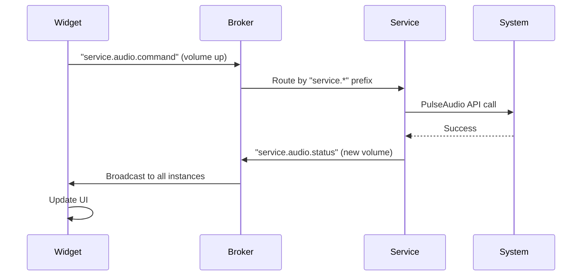

# Service-Oriented Architecture

The launcher separates concerns into **widget plugins** (view), **service plugins** (business logic), and **model crates** (shared data types). This separation
ensures that widgets remain lightweight and reactive, while services handle system interaction independently.

## Three-Tier Crate Structure

## Widget Plugins

- Located in `plugins/`
- Compile to `cdylib` (`.so` files)
- Provide GTK widgets via `WidgetBuilder::build_widget()`
- Receive user input (click, swipe, long-press)
- Send messages to services via the broker
- Can also render to pixel buffers (headless) or HTML (web)
- Use `widget_plugin!(MyWidget);` macro in `lib.rs`

## Service Plugins

- Located in `services/`
- Compile to `cdylib` (`.so` files)
- No UI — pure business logic
- Communicate with the system: DBus, HTTP, hardware, compositor
- Shared across all instances (loaded once by `ServiceManager`)
- Use `service_plugin!(MyService);` macro in `lib.rs`
- Use `tokio::sync::mpsc` for async message handling
- Spawn async tasks via `PluginExecutor`

## Model Crates

- Located in `model/`
- Define shared structs, enums, and message types
- All message types derive `Serialize, Deserialize` from `serde`
- FFI-relevant types carry `#[stabby::stabby]`
- Provide `register_json_converters(context)` function
- Use `impl_json_convertible!` macro for JSON conversion

## Communication Pattern

## Service Manager

The `ServiceManager` (`smearor-swipe-launcher/src/service/manager.rs`) is a singleton that:

- Loads service plugins from `configs/services/services.toml`
- Stores them in a `DashMap<String, LoadedService>`
- Routes `service.*` topic messages to the appropriate service
- Calls `start()` on each service after loading
- Calls `destroy()` on unload (library is leaked to avoid unloading active async tasks)

See [Service-Oriented Architecture > Service Manager](../architecture/service-architecture.md) for implementation details
and [Developing Service Plugins](../plugin-api/service-plugin.md) for a how-to guide.
