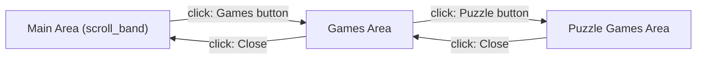

# Dynamic Area Management

Areas can be opened, closed, and toggled at runtime via the message broker. This enables sub-menus, popups, and context-sensitive layouts.

## Area Operations

| Topic         | Description                 | Payload                   |
|---------------|-----------------------------|---------------------------|
| `area.open`   | Open an area by ID          | `{ area_id = "submenu" }` |
| `area.close`  | Close an area by ID         | `{ area_id = "submenu" }` |
| `area.toggle` | Toggle an area's visibility | `{ area_id = "submenu" }` |

## Cross-Instance Area Control

Areas can be controlled across instances using the `instance_id:area_id` syntax:

```toml
click_topic = "area.open"
click_payload = { area_id = "side2:submenu" }
```

The broker detects the colon, extracts the target instance, and routes the message accordingly.

## Transient Areas

Transient areas auto-close when:

- The user clicks outside the area
- The escape key is pressed (if `close_on_escape` is enabled)
- An `area.close` message is received

## Nested Sub-Menus

Areas support unlimited nesting depth. A typical pattern:



## Configuration Example

```toml
[scroll_band]
plugins = [
    { id = "games_menu_button", path = "target/release/libsmearor_button_widget.so" }
]

[games_menu_button]
click_topic = "area.open"
click_payload = { area_id = "games_area" }

[games_area]
include = "../areas/scroll_menu.toml"
open_transition = "SlideUp"
plugins = [
    { id = "games_close_button", path = "target/release/libsmearor_button_widget.so" },
    { id = "puzzle_games_menu_button", path = "target/release/libsmearor_button_widget.so" }
]

[games_close_button]
click_topic = "area.close"
click_payload = { area_id = "games_area" }
```

## Area Includes

Areas can include shared configuration from external files:

```toml
[games_area]
include = "../areas/scroll_menu.toml"
```

This avoids duplication by sharing common area properties (like `area_type`, `spacing`, `css_classes`) across multiple areas.

See [Area System](../architecture/area-system.md) for the architecture perspective, and [Area Configuration](../configuration/area-config.md) for configuration
details.
