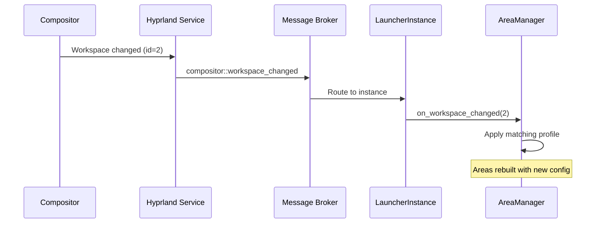

# Layout Profiles

Layout profiles allow the launcher to switch its area configuration based on the active workspace. This enables context-sensitive layouts — for example, a
development workspace with different widgets than a gaming workspace.

## How It Works



## Configuration

Profiles are defined in `config.toml`:

```toml
# Default areas (used when no profile matches)
areas = ["scroll_band"]

# Per-workspace profiles
[[profiles]]
trigger = { Workspace = 2 }
areas = ["development_band"]

[[profiles]]
trigger = { Workspace = 3 }
areas = ["scroll_band", "right_area"]
```

## Profile Trigger

Currently, profiles are triggered by workspace ID. When the compositor signals a workspace change, the launcher checks all profiles and applies the first
matching one.

## Area Rebuilding

When a profile is applied:

1. All current areas are removed
2. The new area set from the profile is created
3. Plugins are loaded into the new areas
4. The visible area is set to the first non-transient area

For headless MacroPad instances, buttons are re-rendered after a profile switch.

See [Area System](../architecture/area-system.md) for the area management architecture.
