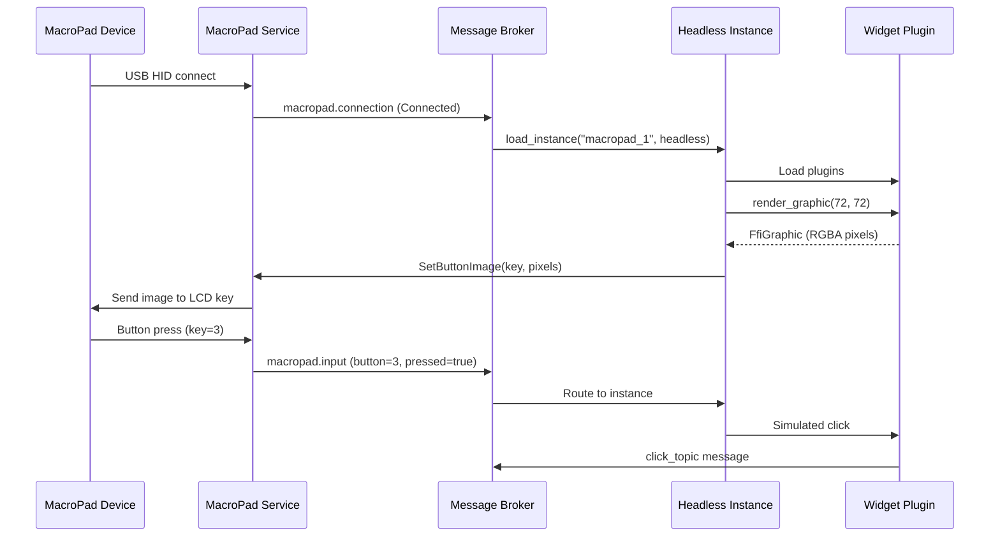

# MacroPad Integration

The launcher supports MacroPad hardware devices such as the Elgato Stream Deck and Loupedeck. This turns the launcher from a touch-only application into a
hybrid touch + physical button controller.

## Supported Devices

| Manufacturer  | Models                                               |
|---------------|------------------------------------------------------|
| **Elgato**    | Stream Deck Mini, Neo, MK.2, XL, Plus, Pedal, Studio |
| **Loupedeck** | CT, Live, Live S, Razer Stream Controller            |

See [MacroPad Models](../reference/macropad-models.md) for full device specifications.

## How It Works



## Headless Instances

MacroPad instances run as **headless instances** — no GTK window is created. Instead:

1. Widgets render via `GraphicRenderer::render_graphic(width, height)` → RGBA pixel buffer
2. The host sends pixel buffers to the MacroPad service via `SetButtonImage` messages
3. The service forwards them to the device driver
4. Button presses arrive as `MacroPadInputMessage` and are routed to the instance

## Button Press Patterns

The launcher supports sophisticated press detection for MacroPad buttons:

| Pattern                 | Detection                                     |
|-------------------------|-----------------------------------------------|
| **Click**               | Short press and release (< 500ms)             |
| **Long-press**          | Press held ≥ 500ms                            |
| **Double-press**        | Two clicks within configurable window         |
| **Hold**                | `hold_start` on press, `hold_stop` on release |
| **Compound long-press** | 2+ buttons in a span group held ≥ 500ms       |

## Span Groups

Span groups allow a single logical button to span multiple physical keys. This enables 2D layouts where some buttons are larger than others. Compound long-press
on a span group triggers a special action for all buttons in the group.

## Atomic Widgets

For complex MacroPad layouts, the launcher supports **atomic widgets** — widgets that render as a single combined image covering multiple keys, then split into
individual key images. This enables seamless visuals across adjacent keys.

## Configuration

MacroPad instances are configured with device-specific metadata:

```toml
[instances.macropad_1]
instance_type = "headless"
config_path = "configs/launcher/streamdeck.toml"
```

The device metadata (key count, key dimensions, driver) is attached automatically when the device connects.

See [Instance Types](../architecture/instance-types.md) and [Renderer Systems](../architecture/renderer-systems.md) for technical details.
