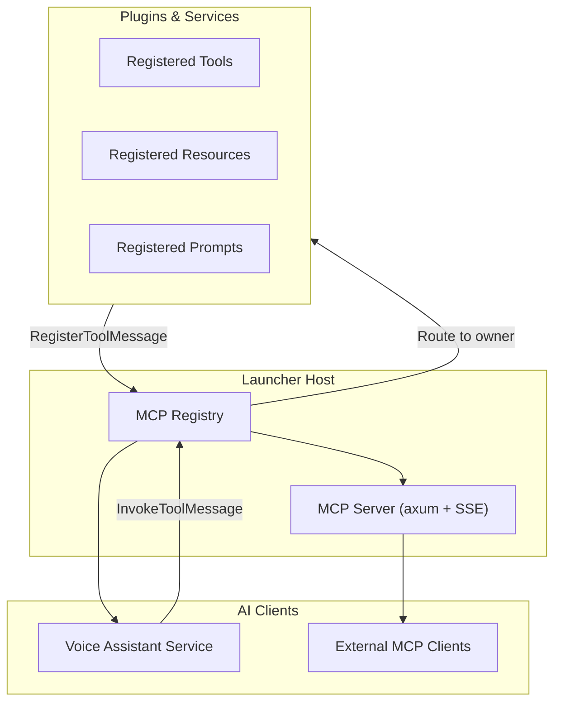

# MCP Server and AI Integration

The launcher includes a built-in **Model Context Protocol (MCP)** server that exposes its capabilities to external AI clients and an internal voice assistant.

## Architecture



## Core MCP Tools

The launcher core provides these tools:

| Tool                  | Description                           |
|-----------------------|---------------------------------------|
| `open_area`           | Open an area by ID                    |
| `close_area`          | Close an area by ID                   |
| `toggle_area`         | Toggle an area's visibility           |
| `list_areas`          | List areas in the current instance    |
| `list_all_areas`      | List all areas across all instances   |
| `focus_area`          | Focus a specific area                 |
| `send_message`        | Send a broker message                 |
| `get_area_config`     | Get configuration for an area         |
| `open_transient_area` | Open a transient (auto-closing) area  |
| `launcher_get_logs`   | Retrieve captured tracing log entries |

## Plugin-Registered Tools

Plugins and services register their own MCP tools via `RegisterToolMessage`. Examples:

- `audio_volume_up`, `audio_volume_down`, `audio_toggle_mute` (audio service)
- `power_shutdown`, `power_reboot`, `power_suspend` (power service)
- `weather_lookup_coordinates`, `weather_get_forecast` (weather service)
- `app_launch`, `app_search` (app-launcher service)
- `network_scan`, `network_connect` (network service)
- `wallpaper_set`, `wallpaper_list_themes` (wallpaper service)
- `mpris_play`, `mpris_pause`, `mpris_next` (mpris service)

## MCP Resources

Resources expose static or dynamic data:

- `launcher://config` — Current launcher configuration
- `launcher://areas` — Area layout information
- `voice_assistant://llm` — Active LLM model details
- `voice_assistant://transcript` — Current conversation transcript

## MCP Prompts

Prompts provide context templates for AI clients:

- `launcher_overview` — System overview for AI
- `area_control_help` — How to control areas
- `broker_message_guide` — Message broker usage guide
- `weather_query_guide` — How to query weather (dynamic location context)
- `mpris_control_guide` — Media player control instructions
- `power_action_guide` — Power management instructions

## Voice Assistant Integration

The `voice_assistant` service uses the MCP registry to:

1. Build a tool catalog from all registered tools
2. Use a ReAct (Reason + Act) loop with a local LLM
3. Select and invoke tools based on user queries
4. Return natural language answers

The voice assistant runs entirely locally using `llama-cpp-4` for LLM inference and `whisper-rs` for speech recognition.

## Transport

The MCP server supports:

- **Streamable HTTP + SSE** — For external clients
- **Internal message broker** — For the voice assistant (via `InvokeToolMessage` / `InvokeToolResponse`)

## Log Capture Tool: `launcher_get_logs`

Retrieves log entries from the built-in tracing ring buffer. Unlike other core tools, this is a **direct handler** — it queries the in-process `LogBuffer`
directly without routing through the message broker.

Useful for debugging, evaluation, and diagnostics.

**Parameters:**

| Parameter       | Type     | Default   | Description                                                      |
|-----------------|----------|-----------|------------------------------------------------------------------|
| `min_level`     | `String` | `"debug"` | Minimum log level: `trace`, `debug`, `info`, `warn`, `error`     |
| `target_prefix` | `String` | `None`    | Filter by tracing target prefix (e.g. `smearor_voice_assistant`) |
| `since_seconds` | `u64`    | `None`    | Only entries from the last N seconds                             |
| `limit`         | `usize`  | `100`     | Maximum number of entries to return (most recent N)              |

**Response:**

```json
{
  "total_returned": 2,
  "total_in_buffer": 1543,
  "buffer_capacity": 10000,
  "entries": [
    {
      "timestamp_ms": 1723124123456,
      "level": "INFO",
      "target": "smearor_voice_assistant::react",
      "message": "ReAct iteration 2",
      "fields": [
        "user_id=42"
      ],
      "file": "src/react.rs",
      "line": 123
    }
  ]
}
```

**Disabling:** Set `log_buffer_enabled = false` or `log_buffer_capacity = 0` in `[mcp]` config. When disabled, the tool returns an error and no `LogBufferLayer`
is installed (zero overhead). See [Services Configuration](../configuration/services-config.md#mcp-server-configuration).
