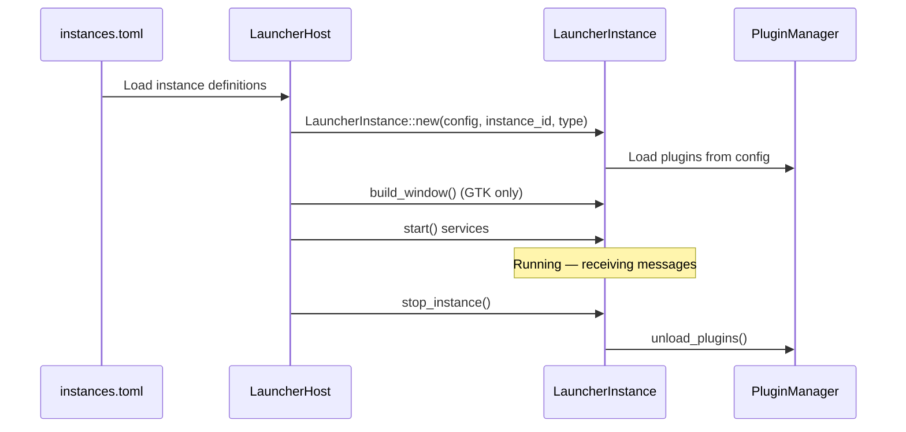

# Multi-Instance

The launcher supports running multiple instances simultaneously in a single host process. Each instance has its own window, plugins, and areas, but shares the
central message broker and service manager.

## Why Multi-Instance?

On a table-top touch screen like the Smearor, each side of the table needs its own launcher facing the user. Multi-instance allows all four sides to run
independently while sharing services (audio, network, weather, etc.) and communicating via inter-instance events.

## Instance Lifecycle



## Instance Configuration

Instances are defined in `instances.toml`:

```toml
[instances.side1]
instance_type = "gtk"
config_path = "configs/launcher/config.toml"

[instances.side2]
instance_type = "gtk"
config_path = "configs/launcher/config-side2.toml"

[instances.macropad_1]
instance_type = "headless"
config_path = "configs/launcher/streamdeck.toml"
```

## Dynamic Instance Management

Instances can be loaded and unloaded at runtime via broker messages:

| Topic                  | Description                        |
|------------------------|------------------------------------|
| `core.instance.load`   | Load a new instance                |
| `core.instance.stop`   | Stop and unload an instance        |
| `core.instance.reload` | Reload an instance with new config |

This is used by the MacroPad integration: when a Stream Deck connects, a headless instance is dynamically loaded; when it disconnects, the instance is stopped.

## Shared vs. Isolated

| Component       | Shared or Isolated            |
|-----------------|-------------------------------|
| Message Broker  | Shared (single channel)       |
| Service Manager | Shared (services loaded once) |
| MCP Registry    | Shared                        |
| GTK Application | Shared                        |
| PluginManager   | Isolated per instance         |
| AreaManager     | Isolated per instance         |
| Window          | Isolated per instance         |

See [Inter-Instance Events](../architecture/inter-instance-events.md) for how instances communicate.
