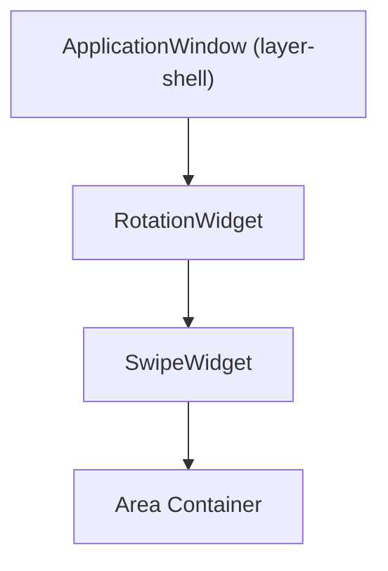

# Rotation

The launcher supports rotation at 0°, 90°, 180°, and 270°. This is essential for table-top installations where each side of the table needs a launcher facing
the user.

## How Rotation Works

Rotation affects three things:

1. **Visual orientation** — The `RotationWidget` from `smearor-wrot-rotation` rotates the entire widget tree
2. **Layer-shell position** — The window anchors to a different screen edge depending on rotation
3. **Input coordinate mapping** — Touch and mouse coordinates are transformed to match the rotated layout

## Rotation Degrees and Positions

| Rotation | Position | Edge                      |
|----------|----------|---------------------------|
| 0°       | Bottom   | Layer-shell bottom anchor |
| 90°      | Left     | Layer-shell left anchor   |
| 180°     | Top      | Layer-shell top anchor    |
| 270°     | Right    | Layer-shell right anchor  |

## Widget Tree



## Configuration

Rotation is set in `config.toml`:

```toml
[launcher]
rotation = 0
```

## App Launch with Rotation

When launching applications via `smearor-wrot`, the rotation parameter is passed so that the launched app opens with the correct orientation.

Set `follows_rotation = true` in the wrapper config — the launcher automatically injects its own `[launcher] rotation` value into the wrapper at config load
time:

```toml
[launcher]
rotation = 180

[my_app]
defaults = "app_launcher"
desktop_file_path = "/usr/share/applications/myapp.desktop"
[my_app.wrapper]
follows_rotation = true
```

This is essential for multi-instance setups where each launcher instance has a different rotation (e.g. `top.toml` with 180° and `bottom.toml` with 0°). Each
launcher injects its own rotation, so apps launched from either instance open with the correct orientation.

An explicit `wrapper.rotation` value overrides the injected value if both are set.

## Runtime Rotation

The launcher can respond to rotation changes at runtime. When the compositor signals a monitor change or rotation event, the launcher adjusts its layer-shell
anchors and re-renders the widget tree.

Note: Runtime rotation changes do **not** automatically update the rotation injected into app-launcher wrapper configs. The injection happens at config load
time. For apps that need to follow runtime rotation changes, set an explicit `wrapper.rotation` or restart the launcher instance.
