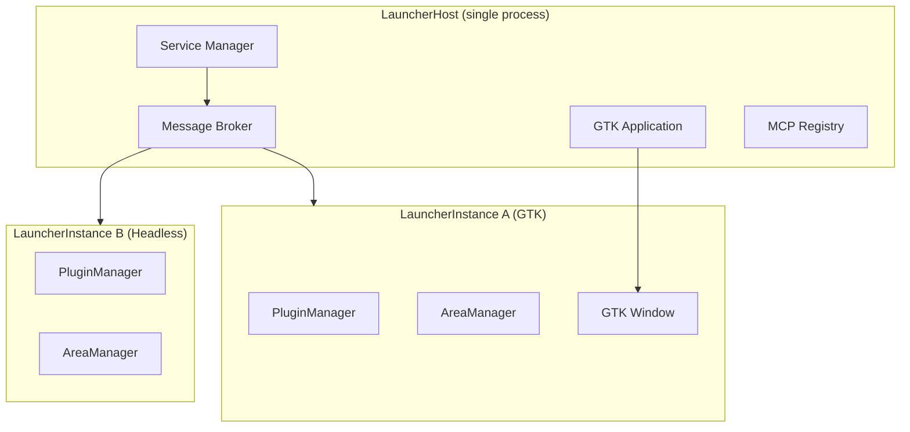

# Motivation and Overview

The **Smearor Swipe Launcher** is a swipe-driven, touch-optimized application launcher for Wayland desktops. It was originally designed for table-top touch
screens like the Smearor table, but is not limited to that use case.

## Target Platform: Touch and Table-Top

The launcher is built from the ground up for **touch interaction**. Swipe gestures (left/right/up/down), long-press, and double-press are native interaction
patterns. Since the target platform has touch available and screen space can be saved, the launcher foregoes traditional window decorations and menus in favor
of a compact ribbon interface.

## Multi-Instance Capability

Each side of a table or monitor can have its own launcher running. The launcher is **multi-instance capable**: multiple `LauncherInstance` processes share a
single host process (`LauncherHost`), which manages the central message broker, the service manager, and the GTK application. Each instance has its own
`PluginManager`, `AreaManager`, and window.

## Rotation

Since each side of a table needs a launcher facing the user, the launcher supports **rotation** (0°, 90°, 180°, 270°). Rotation determines not only the visual
orientation, but also the position of the layer-shell window (bottom, left, top, right) and the coordinate transformation for touch events.

## Native GTK-4 Widgets

The launcher uses **native GTK-4 widgets**. Unlike web-based launchers, it has full control over rendering, gesture handling, and integration with the Wayland
compositor. Plugins deliver their widgets across an FFI boundary using `stabby` (ABI-stable trait objects) as dynamic libraries (`.so`).

## MacroPad Integration

The launcher supports **MacroPad hardware** such as Elgato Stream Deck and Loupedeck. Headless instances render widgets as RGBA pixel buffers and send them to
the device's LCD keys. Button presses are forwarded as messages to plugins. This makes the launcher not just a touch launcher, but also a productive MacroPad
controller.

## Inter-Instance Events

Instances communicate through the central **message broker**. Messages are routed via topics and `target_instance_id`. This allows a plugin in instance A to
send an event to a plugin in instance B — for example, to open an area or trigger an action.

## Loose Coupling and Extensibility

The **plugin system** enables loose coupling. Widgets and services are developed as separate crates and loaded at runtime as dynamic libraries. Shared model
crates define the message types exchanged across the FFI boundary.

## Service-Oriented Architecture

The launcher follows a **service-oriented architecture** with three crate types:

- **Widget Plugins** (`plugins/`): Provide GTK widgets, receive user input, send messages.
- **Service Plugins** (`services/`): Implement business logic without UI, communicate with the system (DBus, HTTP, hardware).
- **Model Crates** (`model/`): Define shared structs, enums, and message types.

## Deep System Integration

The launcher integrates deeply with the surrounding system:

- **Hyprland**: Workspace tracking, window management, dispatch actions
- **GNOME**: Settings, shell integration
- **Desktop Portal**: XDG Desktop Portal for screenshots, location, settings
- **MPRIS**: Media player control via DBus
- **Wayland**: Layer shell, monitor events, workspace lifecycle

## Plugin Utility

The launcher ships with a growing set of ready-made plugins:

- **Weather**: Weather forecast with 15 views (current, forecast, wind, UV, etc.)
- **Voice Assistant**: Local LLM-based voice assistant with ReAct tool selection
- **Sysinfo**: CPU, memory, disk, network, temperature, uptime, load
- **Network**: WiFi, Ethernet, VPN, airplane mode, QR code
- **Power**: Shutdown, reboot, suspend, hibernate, lock, logout
- **Audio**: Volume control via PulseAudio
- **MPRIS**: Media player control
- **Wallpaper**: Wallpaper switching with theme preview
- **Workspace Switcher**: Visual workspace switching
- **Notifications**: Notification banners and badge

## Architecture Overview

For more details on the architecture, see the following chapters:

- [Architecture > Overview](../architecture/overview.md)
- [Architecture > Plugin System](../architecture/plugin-system.md)
- [Architecture > Message Broker](../architecture/message-broker.md)
