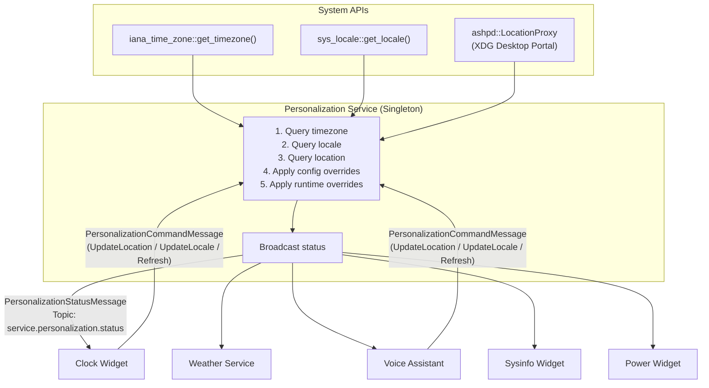

# Concept: Personalization Service

This document describes the concept for a **Personalization Service** in the *Smearor Swipe Launcher*. The service acts as a central source of truth for
user-specific data such as geographic location, timezone, language, and display preferences. Other services and widgets subscribe to personalization updates and
adapt their behavior accordingly.

The system follows the decoupled SOA architecture:

1. **Model Crate (`model/personalization`):** Shared structs, enums, topics, and message formats.
2. **Service Crate (`services/personalization`):** Singleton background service that queries system APIs and broadcasts personalization status.
3. **Consumer Crates:** Services and widgets that subscribe to personalization updates (Clock, Weather, Voice Assistant, etc.).

---

## 1. Motivation & Problem

Currently, personalization data is scattered across multiple plugins:

- **Clock Widget:** Has its own `timezone` config field and hardcoded German weekday names.
- **Weather Service:** Has hardcoded `latitude`, `longitude`, `location_name`, and `timezone` in its config.
- **Voice Assistant:** Has no access to the user's locale for language-aware responses.

This leads to:

- **Redundant configuration:** Users must set their location and timezone in multiple places.
- **Inconsistent localization:** Weekday names are hardcoded to German; other widgets cannot adapt to the user's preferred language.
- **No dynamic adaptation:** If the user travels or changes system settings, each plugin must be reconfigured individually.

### The Solution: A Central Personalization Service

A single service queries the system for location, timezone, and locale data, then broadcasts changes to all interested consumers. Configuration overrides allow
users to pin specific values if automatic detection is undesired.

---

## 2. System Architecture & Data Flow



The service also registers **MCP resources** so that AI clients can query personalization data at any time.

---

## 3. Crate Structure

Following the workspace conventions (`AGENTS.md`), the feature is split into two crates:

| Crate       | Path                        | Responsibility                                                           |
|-------------|-----------------------------|--------------------------------------------------------------------------|
| **Model**   | `model/personalization/`    | Shared structs, enums, topics, and message formats (`#[stabby::stabby]`) |
| **Service** | `services/personalization/` | Backend logic, system API queries, periodic polling, MCP resources       |

Consumer crates (Clock, Weather, Voice Assistant, etc.) depend on the model crate and subscribe to status messages.

---

## 4. Model Crate (`model/personalization`)

### 4.1 Message Topics

```rust
pub const TOPIC_COMMAND: &str = "service.personalization.command";
pub const TOPIC_STATUS: &str = "service.personalization.status";
```

### 4.2 Module Structure

Following the `AGENTS.md` convention of one enum per file, each enum resides in its own module. The `lib.rs` re-exports all types via `pub use`.

```
model/personalization/
├── Cargo.toml
└── src/
    ├── lib.rs                    # Module declarations, pub use re-exports, topics
    ├── coordinates.rs            # GeoCoordinates struct
    ├── temperature_unit.rs       # TemperatureUnit enum
    ├── wind_speed_unit.rs        # WindSpeedUnit enum
    ├── time_format.rs            # TimeFormat enum
    ├── date_format.rs            # DateFormat enum
    ├── first_day_of_week.rs      # FirstDayOfWeek enum
    ├── measurement_system.rs     # MeasurementSystem enum
    ├── color_scheme.rs           # ColorScheme enum
    ├── status_message.rs         # PersonalizationStatusMessage struct
    └── command_message.rs        # PersonalizationCommandMessage + PersonalizationCommandAction
```

### 4.3 `coordinates.rs` — GeoCoordinates

```rust
/// Geographic coordinates of the user's current location.
#[repr(C)]
#[derive(Clone, Debug, Default, Deserialize, Serialize)]
#[stabby::stabby]
pub struct GeoCoordinates {
    /// Latitude in decimal degrees.
    pub latitude: f64,
    /// Longitude in decimal degrees.
    pub longitude: f64,
    /// Human-readable location name (reverse-geocoded or configured).
    pub location_name: stabby::option::Option<stabby::string::String>,
}
```

### 4.4 `temperature_unit.rs` — TemperatureUnit

```rust
/// The user's preferred temperature unit.
#[repr(u8)]
#[derive(Clone, Debug, Default, Deserialize, Serialize, PartialEq, Eq)]
#[stabby::stabby]
pub enum TemperatureUnit {
    /// Degrees Celsius (default).
    #[default]
    Celsius,
    /// Degrees Fahrenheit.
    Fahrenheit,
}
```

### 4.5 `wind_speed_unit.rs` — WindSpeedUnit

```rust
/// The user's preferred wind speed unit.
#[repr(u8)]
#[derive(Clone, Debug, Default, Deserialize, Serialize, PartialEq, Eq)]
#[stabby::stabby]
pub enum WindSpeedUnit {
    /// Kilometers per hour (default).
    #[default]
    Kmh,
    /// Miles per hour.
    Mph,
    /// Meters per second.
    Ms,
}
```

### 4.6 `time_format.rs` — TimeFormat

```rust
/// The user's preferred time format.
#[repr(u8)]
#[derive(Clone, Debug, Default, Deserialize, Serialize, PartialEq, Eq)]
#[stabby::stabby]
pub enum TimeFormat {
    /// 24-hour format (e.g. 14:30).
    #[default]
    Hour24,
    /// 12-hour format with AM/PM (e.g. 2:30 PM).
    Hour12,
}
```

### 4.7 `date_format.rs` — DateFormat

```rust
/// The user's preferred date format.
#[repr(u8)]
#[derive(Clone, Debug, Default, Deserialize, Serialize, PartialEq, Eq)]
#[stabby::stabby]
pub enum DateFormat {
    /// Day.Month.Year (e.g. 26.07.2026) — common in Europe.
    #[default]
    Dmy,
    /// Month/Day/Year (e.g. 07/26/2026) — common in the US.
    Mdy,
    /// Year-Month-Day (e.g. 2026-07-26) — ISO 8601.
    Ymd,
}
```

### 4.8 `first_day_of_week.rs` — FirstDayOfWeek

```rust
/// The user's preferred first day of the week.
#[repr(u8)]
#[derive(Clone, Debug, Default, Deserialize, Serialize, PartialEq, Eq)]
#[stabby::stabby]
pub enum FirstDayOfWeek {
    /// Monday as the first day (default, ISO standard).
    #[default]
    Monday,
    /// Sunday as the first day (common in the US).
    Sunday,
}
```

### 4.9 `measurement_system.rs` — MeasurementSystem

```rust
/// The user's preferred measurement system.
#[repr(u8)]
#[derive(Clone, Debug, Default, Deserialize, Serialize, PartialEq, Eq)]
#[stabby::stabby]
pub enum MeasurementSystem {
    /// Metric system (default).
    #[default]
    Metric,
    /// Imperial system.
    Imperial,
}
```

### 4.10 `color_scheme.rs` — ColorScheme

```rust
/// The user's preferred color scheme.
#[repr(u8)]
#[derive(Clone, Debug, Default, Deserialize, Serialize, PartialEq, Eq)]
#[stabby::stabby]
pub enum ColorScheme {
    /// Follow system settings (default).
    #[default]
    System,
    /// Light mode.
    Light,
    /// Dark mode.
    Dark,
}
```

### 4.11 `status_message.rs` — PersonalizationStatusMessage

```rust
use crate::coordinates::GeoCoordinates;
use crate::color_scheme::ColorScheme;
use crate::date_format::DateFormat;
use crate::first_day_of_week::FirstDayOfWeek;
use crate::measurement_system::MeasurementSystem;
use crate::temperature_unit::TemperatureUnit;
use crate::time_format::TimeFormat;
use crate::wind_speed_unit::WindSpeedUnit;

/// Complete personalization profile broadcast by the service.
#[derive(Clone, Debug, Default, Deserialize, Serialize)]
#[stabby::stabby]
pub struct PersonalizationStatusMessage {
    /// Geographic coordinates of the user's location.
    pub coordinates: stabby::option::Option<GeoCoordinates>,
    /// IANA timezone identifier (e.g. "Europe/Berlin").
    pub timezone: stabby::option::Option<stabby::string::String>,
    /// System locale string (e.g. "de-DE", "en-US").
    pub locale: stabby::option::Option<stabby::string::String>,
    /// Preferred temperature unit.
    pub temperature_unit: TemperatureUnit,
    /// Preferred wind speed unit.
    pub wind_speed_unit: WindSpeedUnit,
    /// Preferred time format (12h/24h).
    pub time_format: TimeFormat,
    /// Preferred date format.
    pub date_format: DateFormat,
    /// First day of the week.
    pub first_day_of_week: FirstDayOfWeek,
    /// Preferred measurement system (metric/imperial).
    pub measurement_system: MeasurementSystem,
    /// Preferred color scheme (light/dark/system).
    pub color_scheme: ColorScheme,
    /// Whether the data was fetched successfully.
    pub success: bool,
    /// Error message if fetching failed.
    pub error_message: stabby::option::Option<stabby::string::String>,
}
```

### 4.12 `command_message.rs` — PersonalizationCommandMessage

The command message supports both refresh requests and **runtime overrides** for location and locale. This allows consumers (e.g. Voice Assistant, Clock Widget)
to update the user's personalization data at runtime without restarting the service or editing config files.

```rust
use crate::coordinates::GeoCoordinates;

/// Actions the personalization service can perform on request.
#[derive(Clone, Debug, Deserialize, Serialize)]
#[stabby::stabby]
pub enum PersonalizationCommandAction {
    /// Force an immediate refresh of all personalization data from system APIs.
    /// Clears all runtime overrides and re-queries system APIs.
    Refresh,
    /// Update the user's location at runtime.
    /// The service stores the new coordinates and broadcasts an updated status.
    /// This overrides any config or auto-detected value until a `Refresh` is triggered
    /// or the service is restarted.
    UpdateLocation {
        /// New geographic coordinates.
        coordinates: GeoCoordinates,
    },
    /// Update the user's locale at runtime.
    /// The service stores the new locale, re-derives unit/format preferences,
    /// and broadcasts an updated status.
    /// This overrides any config or auto-detected value until a `Refresh` is triggered
    /// or the service is restarted.
    UpdateLocale {
        /// New locale string (e.g. "de-DE", "en-US").
        locale: stabby::string::String,
    },
}

/// Command message sent by consumers to the personalization service.
#[derive(Clone, Debug, Deserialize, Serialize)]
#[stabby::stabby]
pub struct PersonalizationCommandMessage {
    /// The action to execute.
    pub action: PersonalizationCommandAction,
}
```

### 4.13 `lib.rs` — Module Declarations & Re-exports

```rust
pub mod command_message;
pub mod color_scheme;
pub mod coordinates;
pub mod date_format;
pub mod first_day_of_week;
pub mod measurement_system;
pub mod status_message;
pub mod temperature_unit;
pub mod time_format;
pub mod wind_speed_unit;

pub use command_message::PersonalizationCommandAction;
pub use command_message::PersonalizationCommandMessage;
pub use color_scheme::ColorScheme;
pub use coordinates::GeoCoordinates;
pub use date_format::DateFormat;
pub use first_day_of_week::FirstDayOfWeek;
pub use measurement_system::MeasurementSystem;
pub use status_message::PersonalizationStatusMessage;
pub use temperature_unit::TemperatureUnit;
pub use time_format::TimeFormat;
pub use wind_speed_unit::WindSpeedUnit;

pub const TOPIC_COMMAND: &str = "service.personalization.command";
pub const TOPIC_STATUS: &str = "service.personalization.status";
```

---

## 5. Service Crate (`services/personalization`)

### 5.1 Configuration

```rust
/// Configuration for the personalization service.
#[derive(Clone, Debug, Deserialize)]
pub struct PersonalizationServiceConfig {
    /// Override the automatically detected latitude.
    pub override_latitude: Option<f64>,
    /// Override the automatically detected longitude.
    pub override_longitude: Option<f64>,
    /// Override the automatically detected timezone (IANA identifier).
    pub override_timezone: Option<String>,
    /// Override the automatically detected locale (e.g. "de-DE").
    pub override_locale: Option<String>,
    /// Override the location name (human-readable).
    pub override_location_name: Option<String>,
    /// Override the temperature unit.
    pub override_temperature_unit: Option<TemperatureUnit>,
    /// Override the wind speed unit.
    pub override_wind_speed_unit: Option<WindSpeedUnit>,
    /// Override the time format.
    pub override_time_format: Option<TimeFormat>,
    /// Override the date format.
    pub override_date_format: Option<DateFormat>,
    /// Override the first day of week.
    pub override_first_day_of_week: Option<FirstDayOfWeek>,
    /// Override the measurement system.
    pub override_measurement_system: Option<MeasurementSystem>,
    /// Override the color scheme.
    pub override_color_scheme: Option<ColorScheme>,
    /// Location accuracy for XDG Desktop Portal (e.g. "Street", "City").
    /// Defaults to "City" to minimize privacy impact.
    #[serde(default = "default_location_accuracy")]
    pub location_accuracy: String,
    /// Update interval for location queries in seconds.
    /// Timezone and locale are checked at start and on each refresh;
    /// location is polled at this interval.
    #[serde(default = "default_update_interval_seconds")]
    pub update_interval_seconds: u64,
    /// Whether to enable XDG Desktop Portal location queries.
    /// If false, only timezone and locale are queried; coordinates remain None.
    #[serde(default = "default_enable_location")]
    pub enable_location: bool,
}
```

### 5.2 Data Sources & Priority

The service queries data in the following priority order:

1. **Config Override** — If a config field is set, it takes absolute precedence.
2. **System API** — Automatic detection via the appropriate library.
3. **Fallback Default** — Sensible defaults if detection fails.

| Data          | Library              | Sync/Async | Fallback     |
|---------------|----------------------|------------|--------------|
| Timezone      | `iana_time_zone`     | Sync       | `UTC`        |
| Locale        | `sys_locale`         | Sync       | `en-US`      |
| Coordinates   | `ashpd` (XDG Portal) | Async      | `None`       |
| Location Name | Reverse geocoding    | Async      | `None`       |
| Units/Formats | Derived from locale  | Sync       | Metric / 24h |
| Color Scheme  | `ashpd` (Settings)   | Async      | `System`     |

### 5.3 Service Implementation

The service implements the standard service plugin traits:

- `ServicePlugin` — `on_message` handles `PersonalizationCommandMessage` and MCP tool invocations.
- `MessageHandler<FfiEnvelopePayload<PersonalizationCommandMessage>>` — Processes refresh commands.
- `MessageHandler<FfiEnvelopePayload<InvokeToolMessage>>` — MCP tool handlers.
- `MessageHandler<FfiEnvelopePayload<InvokeResourceMessage>>` — MCP resource handler.
- `MessageBroadcaster` — Empty impl.
- `MessageTopicBroadcaster<PersonalizationStatusMessage>` — Broadcasts status updates.
- `PluginMetaGetter` — Returns plugin metadata.
- `AsRef<Option<FfiCoreContext>>` — Returns core context.

### 5.4 Update Loop

```
1. Start:
   a. Query timezone via iana_time_zone::get_timezone() (sync)
   b. Query locale via sys_locale::get_locale() (sync)
   c. Derive units/formats from locale
   d. If enable_location: start async location session via ashpd
   e. Broadcast initial PersonalizationStatusMessage

2. Periodic (every update_interval_seconds):
   a. Re-query timezone and locale (detect system changes)
   b. If enable_location: re-query coordinates via ashpd
   c. If no runtime override is active for a field, apply the new value
   d. If any value changed: broadcast updated PersonalizationStatusMessage

3. On Refresh command:
   a. Clear all runtime overrides
   b. Immediately re-query all system APIs
   c. Broadcast updated PersonalizationStatusMessage

4. On UpdateLocation command:
   a. Store runtime override for coordinates
   b. Broadcast updated PersonalizationStatusMessage with new coordinates
   c. Runtime override persists until a Refresh is received or service restarts

5. On UpdateLocale command:
   a. Store runtime override for locale
   b. Re-derive unit/format preferences from new locale
   c. Broadcast updated PersonalizationStatusMessage with new locale and derived values
   d. Runtime override persists until a Refresh is received or service restarts
```

### 5.5 Runtime Override Semantics

Runtime overrides allow consumers to change personalization data dynamically. The override priority is:

1. **Runtime Override** — Set via `UpdateLocation` or `UpdateLocale` command. Highest priority.
2. **Config Override** — Set in `config.toml`. Used if no runtime override is active.
3. **System API** — Auto-detected value. Used if no override is active.
4. **Fallback Default** — Used if all else fails.

A `Refresh` command clears all runtime overrides and re-queries system APIs. This allows consumers to temporarily change the location (e.g. for a travel
scenario) and later restore automatic detection.

**Use Cases:**

- **Voice Assistant:** User says "I'm in Bregenz now" → Voice Assistant sends `UpdateLocation` with Bregenz coordinates → Weather Service receives updated
  status and fetches weather for Bregenz.
- **Clock Widget:** User manually switches locale → Clock sends `UpdateLocale` → Weekday language changes immediately.
- **Travel Mode:** User travels to a different timezone → Voice Assistant detects timezone change via location query and sends `UpdateLocation` → Clock adjusts
  automatically.

### 5.6 MCP Integration

The service registers the following MCP capabilities:

**Resources:**

| URI                         | Description                          |
|-----------------------------|--------------------------------------|
| `personalization://profile` | Full personalization profile as JSON |

**Tools:**

| Tool Name                 | Description                                                                  |
|---------------------------|------------------------------------------------------------------------------|
| `get_current_location`    | Returns latitude, longitude, and location name.                              |
| `get_timezone`            | Returns the current IANA timezone identifier.                                |
| `get_locale`              | Returns the current system locale string.                                    |
| `get_personalization`     | Returns the full personalization profile.                                    |
| `set_current_location`    | Sets a runtime override for the user's location. Accepts latitude/longitude. |
| `set_locale`              | Sets a runtime override for the user's locale. Accepts a locale string.      |
| `refresh_personalization` | Clears all runtime overrides and re-queries system APIs.                     |

---

## 6. Dependencies

```toml
[dependencies]
ashpd = "0.9"
iana-time-zone = "0.1"
sys-locale = "0.3"
stabby = { workspace = true }
serde = { workspace = true }
serde_json = { workspace = true }
tokio = { workspace = true }
tracing = { workspace = true }
tracing-subscriber = { workspace = true }
paste = { workspace = true }
miette = { workspace = true }
thiserror = { workspace = true }
smearor-model-mcp = { path = "../../model/mcp" }
smearor-model-personalization = { path = "../../model/personalization" }
smearor-swipe-launcher-plugin-api = { path = "../../plugin-api" }
```

---

## 7. Phase Implementation Plan

### Phase 1: Model Crate (`model/personalization`)

**Goal:** Create the shared data structures and message formats.

**Tasks:**

- Create `model/personalization/Cargo.toml` with `stabby`, `serde`, `serde_json` dependencies.
- Create `model/personalization/src/lib.rs` with:
    - Topic constants (`TOPIC_COMMAND`, `TOPIC_STATUS`).
    - `GeoCoordinates` struct.
    - Enum types: `TemperatureUnit`, `WindSpeedUnit`, `TimeFormat`, `DateFormat`, `FirstDayOfWeek`, `MeasurementSystem`, `ColorScheme`.
    - `PersonalizationStatusMessage` struct.
    - `PersonalizationCommandMessage` and `PersonalizationCommandAction` structs.
    - All FFI-relevant types annotated with `#[stabby::stabby]`.
    - `impl_json_convertible!` macro for `PersonalizationStatusMessage` and `PersonalizationCommandMessage`.
- Add `model/personalization` to workspace `Cargo.toml`.
- Add `register_json_converters()` function.

**Verification:** `cargo build -p smearor-model-personalization` succeeds.

---

### Phase 2: Service Crate (`services/personalization`)

**Goal:** Implement the personalization service with system API queries.

**Tasks:**

- Create `services/personalization/Cargo.toml` with dependencies (see Section 6).
- Create `services/personalization/src/config.rs`:
    - `PersonalizationServiceConfig` struct with override fields and defaults.
- Create `services/personalization/src/service.rs`:
    - `PersonalizationService` struct with `meta`, `core_context`, `config`, `latest_state`.
    - `new()` constructor: parse config, spawn update loop thread.
    - `register_mcp_capabilities()`: register resources and tools.
    - `start()`: initial data query and broadcast.
    - Update loop: periodic re-query, change detection, broadcast on change.
    - `MessageHandler` impls for command, tool, and resource messages.
    - `ServicePlugin` impl with `on_message` routing.
- Create `services/personalization/src/lib.rs`:
    - Module declarations.
    - `service_plugin!(PersonalizationService);`
- Add `services/personalization` to workspace `Cargo.toml`.

**Data Query Logic:**

- Timezone: `iana_time_zone::get_timezone()` → `Ok("Europe/Berlin")` / `Err` → fallback `"UTC"`.
- Locale: `sys_locale::get_locale()` → `Some("de-DE")` / `None` → fallback `"en-US"`.
- Coordinates: `ashpd::desktop::location::LocationProxy::new().await` → create session → `locate()` → extract lat/lon.
- Derived values: locale prefix determines defaults (e.g. `de-*` → Celsius, 24h, DMY, Metric; `en-US` → Fahrenheit, 12h, MDY, Imperial).

**Verification:** `cargo build -p smearor-personalization-service` succeeds. Service loads and broadcasts initial status.

---

### Phase 3: Clock Widget Integration

**Goal:** Clock widget consumes `PersonalizationStatusMessage` for timezone and locale.

**Tasks:**

- Add `smearor-model-personalization` dependency to `plugins/clock/Cargo.toml`.
- Update `plugins/clock/src/widget.rs`:
    - Add `MessageHandler<FfiEnvelopePayload<PersonalizationStatusMessage>>` impl.
    - Store latest personalization status in `Arc<RwLock<Option<PersonalizationStatusMessage>>>`.
    - On status update: override `config.timezone` with personalization timezone.
    - On status update: use `locale` to determine weekday language (German for `de-*`, English for `en-*`, etc.).
- Update `plugins/clock/src/localized_weekday.rs`:
    - Add `from_locale(locale: &str) -> Self` method to `LocalizedWeekday`.
    - Map locale prefixes to supported languages.
    - Add additional languages as needed (e.g. French, Spanish, Italian).
- Update `plugins/clock/src/clock.rs`:
    - `get_timezone()` uses personalization timezone if available, falls back to config timezone.
    - `get_weekday_localized()` uses locale from personalization status.
- Update `plugins/clock/src/config.rs`:
    - `timezone` field becomes a fallback/override (still respected if personalization service is not running).

**Behavior:**

- If personalization service is running: Clock uses detected timezone and locale.
- If personalization service is not running: Clock falls back to `config.timezone` and German weekdays (current behavior).

**Verification:** Clock displays correct time for detected timezone. Weekday language matches system locale.

---

### Phase 4: Weather Service Integration

**Goal:** Weather service consumes `PersonalizationStatusMessage` for coordinates.

**Tasks:**

- Add `smearor-model-personalization` dependency to `services/weather/Cargo.toml`.
- Update `services/weather/src/service.rs`:
    - Add `MessageHandler<FfiEnvelopePayload<PersonalizationStatusMessage>>` impl.
    - Store latest personalization status in `Arc<RwLock<Option<PersonalizationStatusMessage>>>`.
    - In `run_update_loop`: use personalization coordinates if available, fall back to config coordinates.
    - On personalization update: if coordinates changed, trigger immediate weather refresh.
- Update `services/weather/src/config.rs`:
    - `latitude`, `longitude`, `location_name`, `timezone` become fallback values.
    - Add `use_personalization` flag (default: `true`) to allow disabling auto-detection.

**Behavior:**

- If personalization service is running and `use_personalization = true`: Weather uses detected coordinates.
- If personalization service is not running: Weather falls back to config coordinates (current behavior).
- Weather response data uses `temperature_unit` and `wind_speed_unit` from personalization for display formatting.

**Verification:** Weather widget shows data for the user's actual location. Temperature and wind speed use preferred units.

---

### Phase 5: Voice Assistant Integration

**Goal:** Voice Assistant service consumes `PersonalizationStatusMessage` for locale-aware responses.

**Tasks:**

- Add `smearor-model-personalization` dependency to `services/voice_assistant/Cargo.toml`.
- Update `services/voice_assistant/src/service.rs` (or relevant module):
    - Add `MessageHandler<FfiEnvelopePayload<PersonalizationStatusMessage>>` impl.
    - Store latest personalization status.
    - Inject locale and timezone into LLM system prompts.
    - Use locale to select response language (e.g. `de-DE` → German responses, `en-US` → English responses).
    - Use timezone for time-related queries (e.g. "What time is it?").
    - Use coordinates for location-aware queries (e.g. "What's the weather?") by passing them to the weather service tools.

**Behavior:**

- Voice Assistant responds in the user's preferred language.
- Time-related answers use the user's timezone.
- Location-related queries use the user's coordinates without explicit configuration.

**Verification:** Voice Assistant responds in German when locale is `de-DE`. Time queries return correct local time. Weather queries use detected location.

---

## 8. Widget Localization Phases

The following sections describe localization plans for each widget that consumes `PersonalizationStatusMessage`. Each phase follows the same pattern established
by the Clock and Weather widget integrations:

1. **Dependency & Infrastructure** — Add `smearor-personalization-model` dependency, implement `PersonalizationOverride` struct, `MessageHandler` impl,
   `AcceptTopic` extension.
2. **Unit/Format Conversion** — Use personalization fields (`MeasurementSystem`, `TimeFormat`, etc.) to convert raw API values into display strings.
3. **Label Translation** — Replace hardcoded English strings with locale-aware labels via a `localized_label()` method on a label enum.
4. **Fallback Behavior** — Without personalization service, fall back to current defaults.

### Rendering Scope

Localization must be applied across **all rendering surfaces** of each widget, using the Weather widget as the reference implementation:

- **Main Widget** (`widget.rs`) — The primary widget implementation. Stores `PersonalizationOverride` in `Rc<RefCell<PersonalizationOverride>>`, uses it in
  `render_view()` for unit conversion and label translation.
- **Atomic Widgets** (`atomic.rs`) — Compact variants shown in bars and panels. Each atomic widget stores its own `PersonalizationOverride` and applies it in
  `render_atomic_view()`. Uses `extra_message_types` in `atomic_widget_impl!` macro to subscribe to `PersonalizationStatusMessage`.
- **Graphic Renderer** (`graphic.rs`) — Renders pixel-based graphics via `GraphicRenderer` trait. Reads `PersonalizationOverride` from the widget's
  `personalization` field and passes it to `render_view()` to ensure icon selection and text labels respect locale and units.
- **HTML Renderer** (`html.rs`) — Renders HTML output via `WebRenderer` trait. Reads `PersonalizationOverride` from the widget's `personalization` field and
  passes it to `render_view()` for consistent locale-aware output.

### Transient Area Pattern

Atomic widgets often live in **transient areas** (e.g. dropdown panels, overlays) that are created on-demand and may not exist yet when the personalization
service broadcasts its initial status. Therefore, each atomic widget must:

1. **Request personalization status on construction** — Call `request_personalization_status()` in `new()` to broadcast a
   `PersonalizationCommandMessage::request_status()`, which triggers the personalization service to re-broadcast the current status.
2. **Handle `PersonalizationStatusMessage` in `on_message`** — Store the received data in `Rc<RefCell<PersonalizationOverride>>` and trigger a UI update.
3. **Fall back to defaults** — If no personalization data arrives (service not running), use `PersonalizationOverride::default()` which provides sensible
   defaults (English, metric, 24h, etc.).

This pattern is already implemented in the Weather atomic widget (`plugins/weather/src/atomic.rs`) and serves as the template for all other atomic widgets.

### 8.1 Button Widget

#### Infrastructure

- **`plugins/button/Cargo.toml`** — Add `smearor-personalization-model` dependency.
- **`PersonalizationOverride` struct** — Store `time_format`, `date_format`, `locale`.
- **`MessageHandler<PersonalizationStatusMessage>`** impl.
- **`AcceptTopic`** — Extend with `TOPIC_PERSONALIZATION_STATUS`.

#### Format Conversion

**Embedded Timestamps** — `TimeFormat` + `DateFormat` from personalization:

- If `main_text` or `info_text` contains date/time template variables (e.g. `{time}`, `{date}`), format them according to personalization preferences.
- `Hour24` + `Dmy` → `DD.MM.YYYY HH:MM`
- `Hour12` + `Mdy` → `MM/DD/YYYY h:MM AM/PM`
- Affects: Buttons that display dynamic time/date values.

#### Fallback

Without personalization service → `Hour24`, `Dmy`, current template behavior.

---

### 8.2 Audio Widget

#### Infrastructure

- **`plugins/audio/Cargo.toml`** — Add `smearor-personalization-model` dependency.
- **`PersonalizationOverride` struct** — Store `locale`.
- **`MessageHandler<PersonalizationStatusMessage>`** impl.
- **`AcceptTopic`** — Extend with `TOPIC_PERSONALIZATION_STATUS`.
- **`on_message`** — Dispatch `PersonalizationStatusMessage`.

#### Label Translation

| Label Key  | English (en) | German (de)    | French (fr)          | Spanish (es)          | Italian (it)           |
|------------|--------------|----------------|----------------------|-----------------------|------------------------|
| Volume     | Volume       | Lautstärke     | Volume               | Volumen               | Volume                 |
| Muted      | Muted        | Stumm          | Muet                 | Silenciado            | Muto                   |
| Mute       | Mute         | Stumm          | Muet                 | Silenciar             | Muto                   |
| VolumeUp   | Volume Up    | Lauter         | Augmenter            | Subir volumen         | Aumenta volume         |
| VolumeDown | Volume Down  | Leiser         | Diminuer             | Bajar volumen         | Abbassa volume         |
| NextDevice | Next Device  | Nächstes Gerät | Périphérique suivant | Dispositivo siguiente | Dispositivo successivo |
| NoDevice   | No device    | Kein Gerät     | Aucun périphérique   | Sin dispositivo       | Nessun dispositivo     |

#### Fallback

Without personalization service → English labels.

---

### 8.3 MPRIS Widget

#### Infrastructure

- **`plugins/mpris/Cargo.toml`** — Add `smearor-personalization-model` dependency.
- **`PersonalizationOverride` struct** — Store `time_format`, `locale`.
- **`MessageHandler<PersonalizationStatusMessage>`** impl.
- **`AcceptTopic`** — Extend with `TOPIC_PERSONALIZATION_STATUS`.
- **`on_message`** — Dispatch `PersonalizationStatusMessage`.

#### Format Conversion

**Progress Timestamps** — `TimeFormat` from personalization:

- `Hour24` → `MM:SS` / `HH:MM:SS` for elapsed/total time
- `Hour12` → `M:SS` / `H:MM:SS` for elapsed/total time (rarely >1h, but supported)
- Affects: Progress bar elapsed/remaining time display.

#### Label Translation

| Label Key     | English (en)   | German (de)          | French (fr)     | Spanish (es)        | Italian (it)        |
|---------------|----------------|----------------------|-----------------|---------------------|---------------------|
| UnknownArtist | Unknown artist | Unbekannter Künstler | Artiste inconnu | Artista desconocido | Artista sconosciuto |
| UnknownTitle  | Unknown title  | Unbekannter Titel    | Titre inconnu   | Título desconocido  | Titolo sconosciuto  |
| UnknownAlbum  | Unknown album  | Unbekanntes Album    | Album inconnu   | Álbum desconocido   | Album sconosciuto   |
| NoPlayer      | No player      | Kein Player          | Aucun lecteur   | Sin reproductor     | Nessun lettore      |
| Playing       | Playing        | Wiedergabe           | Lecture         | Reproduciendo       | In riproduzione     |
| Paused        | Paused         | Pausiert             | En pause        | En pausa            | In pausa            |
| Stopped       | Stopped        | Gestoppt             | Arrêté          | Detenido            | Fermato             |

#### Fallback

Without personalization service → `Hour24`, English fallback strings.

---

### 8.4 Power Widget

#### Infrastructure

- **`plugins/power/Cargo.toml`** — Add `smearor-personalization-model` dependency.
- **`PersonalizationOverride` struct** — Store `time_format`, `locale`.
- **`MessageHandler<PersonalizationStatusMessage>`** impl.
- **`AcceptTopic`** — Extend with `TOPIC_PERSONALIZATION_STATUS`.

#### Format Conversion

**Countdown Timer** — `TimeFormat` from personalization:

- `Hour24` → `HH:MM:SS` countdown display
- `Hour12` → `h:MM:SS AM/PM` countdown display (if countdown spans midnight)
- Affects: Scheduled shutdown/reboot countdown text.

#### Label Translation

| Label Key    | English (en)          | German (de)            | French (fr)      | Spanish (es)     | Italian (it)        |
|--------------|-----------------------|------------------------|------------------|------------------|---------------------|
| Shutdown     | Shutdown              | Herunterfahren         | Arrêter          | Apagar           | Spegni              |
| Reboot       | Reboot                | Neustart               | Redémarrer       | Reiniciar        | Riavvia             |
| Suspend      | Suspend               | Ruhezustand            | Mettre en veille | Suspender        | Sospendi            |
| Hibernate    | Hibernate             | Tiefschlaf             | Hibernation      | Hibernar         | Iberna              |
| Cancel       | Cancel                | Abbrechen              | Annuler          | Cancelar         | Annulla             |
| ShuttingDown | Shutting down in {n}s | Herunterfahren in {n}s | Arrêt dans {n}s  | Apagando en {n}s | Spegnimento in {n}s |

#### Fallback

Without personalization service → `Hour24`, English labels.

---

### 8.5 Network Widget

#### Infrastructure

- **`plugins/network/Cargo.toml`** — Add `smearor-personalization-model` dependency.
- **`PersonalizationOverride` struct** — Store `measurement_system`, `locale`.
- **`MessageHandler<PersonalizationStatusMessage>`** impl.
- **`AcceptTopic`** — Extend with `TOPIC_PERSONALIZATION_STATUS`.

#### Unit Conversion

**Bandwidth** — `MeasurementSystem` from personalization:

- `Metric` → `{:.1} Mbps`, `{:.1} MB/s` (current behavior)
- `Imperial` → `{:.1} MiB/s` (binary prefixes for imperial)
- Affects: Download/upload speed display.

**Signal Strength** — `MeasurementSystem` from personalization:

- `Metric` → `{:.0} dBm` (current behavior, no conversion needed)
- `Imperial` → `{:.0} dBm` (same — dBm is unit-agnostic)

#### Label Translation

| Label Key    | English (en) | German (de) | French (fr)    | Spanish (es) | Italian (it) |
|--------------|--------------|-------------|----------------|--------------|--------------|
| Connected    | Connected    | Verbunden   | Connecté       | Conectado    | Connesso     |
| Disconnected | Disconnected | Getrennt    | Déconnecté     | Desconectado | Disconnesso  |
| Signal       | Signal       | Signal      | Signal         | Señal        | Segnale      |
| Strength     | Strength     | Stärke      | Force          | Intensidad   | Intensità    |
| Download     | Download     | Download    | Téléchargement | Descarga     | Download     |
| Upload       | Upload       | Upload      | Envoi          | Subida       | Upload       |
| WiFi         | WiFi         | WLAN        | WiFi           | WiFi         | WiFi         |

#### Fallback

Without personalization service → `Metric`, English labels.

---

### 8.6 Wallpaper Widget

#### Infrastructure

- **`plugins/wallpaper/Cargo.toml`** — Add `smearor-personalization-model` dependency.
- **`PersonalizationOverride` struct** — Store `color_scheme`, `locale`.
- **`MessageHandler<PersonalizationStatusMessage>`** impl.
- **`AcceptTopic`** — Extend with `TOPIC_PERSONALIZATION_STATUS`.

#### Format Conversion

**Color Scheme** — `ColorScheme` from personalization:

- `Light` → Select light wallpaper theme.
- `Dark` → Select dark wallpaper theme.
- `System` → React to system dark mode changes (via `gsettings` or D-Bus).
- Affects: Which wallpaper set is displayed.

#### Label Translation

| Label Key | English (en) | German (de) | French (fr) | Spanish (es) | Italian (it) |
|-----------|--------------|-------------|-------------|--------------|--------------|
| Light     | Light        | Hell        | Clair       | Claro        | Chiaro       |
| Dark      | Dark         | Dunkel      | Sombre      | Oscuro       | Scuro        |
| System    | System       | System      | Système     | Sistema      | Sistema      |
| Next      | Next         | Weiter      | Suivant     | Siguiente    | Avanti       |
| Previous  | Previous     | Zurück      | Précédent   | Anterior     | Indietro     |

#### Fallback

Without personalization service → `System` color scheme, English labels.

---

<!-- NOTE: Between 8.6 and 8.7, ICON_RENDERING.md must be finalized first. -->

### 8.7 App Launcher Widget

#### Infrastructure

- **`plugins/app-launcher/Cargo.toml`** — Add `smearor-personalization-model` dependency.
- **`PersonalizationOverride` struct** — Store `locale`.
- **`MessageHandler<PersonalizationStatusMessage>`** impl.
- **`AcceptTopic`** — Extend with `TOPIC_PERSONALIZATION_STATUS`.

#### Label Translation

**Category Names** — `Locale` from personalization:

| Label Key   | English (en)     | German (de)      | French (fr)    | Spanish (es)   | Italian (it)     |
|-------------|------------------|------------------|----------------|----------------|------------------|
| Development | Development      | Entwicklung      | Développement  | Desarrollo     | Sviluppo         |
| Games       | Games            | Spiele           | Jeux           | Juegos         | Giochi           |
| Graphics    | Graphics         | Grafik           | Graphisme      | Gráficos       | Grafica          |
| Internet    | Internet         | Internet         | Internet       | Internet       | Internet         |
| Multimedia  | Multimedia       | Multimedia       | Multimédia     | Multimedia     | Multimedia       |
| Office      | Office           | Büro             | Bureau         | Oficina        | Ufficio          |
| Settings    | Settings         | Einstellungen    | Paramètres     | Configuración  | Impostazioni     |
| System      | System           | System           | Système        | Sistema        | Sistema          |
| Utilities   | Utilities        | Dienstprogramme  | Utilitaires    | Utilidades     | Utilità          |
| Search      | Search           | Suchen           | Rechercher     | Buscar         | Cerca            |
| NoResults   | No results found | Keine Ergebnisse | Aucun résultat | Sin resultados | Nessun risultato |

**Sort Order** — `Locale` from personalization:

- Use locale-aware collation for alphabetical app sorting (e.g. `de` sorts "ä" after "a", `sv` sorts "ä" after "z").

#### Fallback

Without personalization service → English category names, default sort order.

---

### 8.8 Sysinfo Widget

#### Infrastructure

- **`plugins/sysinfo/Cargo.toml`** — Add `smearor-personalization-model` dependency.
- **`PersonalizationOverride` struct** — Store `measurement_system`, `temperature_unit`, `locale`.
- **`MessageHandler<PersonalizationStatusMessage>`** impl — Receive personalization data, store in `Rc<RefCell<PersonalizationOverride>>`.
- **`AcceptTopic`** — Extend with `TOPIC_PERSONALIZATION_STATUS`.
- **`on_message`** — Dispatch `PersonalizationStatusMessage`.

#### Unit Conversion

**Temperature** — `TemperatureUnit` from personalization:

- `Celsius` → `{:.0}°C` (no conversion, API delivers °C)
- `Fahrenheit` → `{:.0}°F` (conversion: `°F = °C * 9/5 + 32`)
- Affects: CPU temperature, GPU temperature, disk temperature sensors.

**Disk/Network Speeds** — `MeasurementSystem` from personalization:

- `Metric` → `{:.1} MB/s`, `{:.1} GB` (current behavior)
- `Imperial` → `{:.1} MiB/s`, `{:.1} GiB` (use binary prefixes)
- Affects: Disk read/write speeds, network throughput, disk capacity.

#### Label Translation

**`Locale`** from personalization — hardcoded strings replaced with locale-aware labels:

| Label Key   | English (en) | German (de)     | French (fr) | Spanish (es) | Italian (it) |
|-------------|--------------|-----------------|-------------|--------------|--------------|
| CPU         | CPU          | Prozessor       | Processeur  | Procesador   | Processore   |
| Memory      | Memory       | Arbeitsspeicher | Mémoire     | Memoria      | Memoria      |
| Disk        | Disk         | Festplatte      | Disque      | Disco        | Disco        |
| Network     | Network      | Netzwerk        | Réseau      | Red          | Rete         |
| Temperature | Temp         | Temp            | Temp        | Temp         | Temp         |
| Upload      | Upload       | Upload          | Envoi       | Subida       | Upload       |
| Download    | Download     | Download        | Réception   | Descarga     | Download     |

- Implementation as `fn localized_label(key: SysinfoLabel, locale: Locale) -> &'static str` via `SysinfoLabel` enum.

#### Fallback

Without personalization service → current defaults: `Celsius`, `Metric`, English labels.

---

### 8.9 Notifications Widget

#### Infrastructure

- **`plugins/notifications/Cargo.toml`** — Add `smearor-personalization-model` dependency.
- **`PersonalizationOverride` struct** — Store `time_format`, `date_format`, `locale`.
- **`MessageHandler<PersonalizationStatusMessage>`** impl.
- **`AcceptTopic`** — Extend with `TOPIC_PERSONALIZATION_STATUS`.

#### Format Conversion

**Timestamps** — `TimeFormat` + `DateFormat` from personalization:

- `Hour24` + `Dmy` → `DD.MM.YYYY HH:MM`
- `Hour12` + `Mdy` → `MM/DD/YYYY h:MM AM/PM`
- `Hour24` + `Ymd` → `YYYY-MM-DD HH:MM`
- Affects: Notification timestamps in list view.

**Relative Time** — `Locale` from personalization:

- `en` → "5 minutes ago", "just now", "1 hour ago"
- `de` → "vor 5 Minuten", "gerade eben", "vor 1 Stunde"
- `fr` → "il y a 5 minutes", "à l'instant", "il y a 1 heure"
- `es` → "hace 5 minutos", "ahora mismo", "hace 1 hora"
- `it` → "5 minuti fa", "adesso", "1 ora fa"

#### Label Translation

| Label Key       | English (en)     | German (de)              | French (fr)         | Spanish (es)       | Italian (it)     |
|-----------------|------------------|--------------------------|---------------------|--------------------|------------------|
| Clear           | Clear            | Leeren                   | Effacer             | Borrar             | Cancella         |
| NoNotifications | No notifications | Keine Benachrichtigungen | Aucune notification | Sin notificaciones | Nessuna notifica |
| Notifications   | Notifications    | Benachrichtigungen       | Notifications       | Notificaciones     | Notifiche        |

#### Fallback

Without personalization service → `Hour24`, `Dmy`, English relative time strings.

---

## 9. Configuration Example

```toml
[[services]]
type = "personalization"
id = "personalization"
display_name = "Personalization"

[services.config]
# Automatic detection (no overrides needed for most users)
enable_location = true
location_accuracy = "City"
update_interval_seconds = 300

# Optional overrides (uncomment to pin specific values)
# override_latitude = 47.5031
# override_longitude = 9.7471
# override_location_name = "Bregenz"
# override_timezone = "Europe/Vienna"
# override_locale = "de-DE"
# override_temperature_unit = "celsius"
# override_time_format = "24h"
```

---

## 10. Advantages of This Design

- **Single Source of Truth:** All personalization data is managed in one service, eliminating redundant configuration.
- **Automatic Adaptation:** The system detects location, timezone, and language automatically. Users do not need to configure each plugin separately.
- **Graceful Degradation:** If the personalization service is not running, each consumer falls back to its own config values. No hard dependency.
- **Privacy-Conscious:** Location queries use XDG Desktop Portal, which requires user consent. Location can be disabled entirely via config.
- **MCP-Integrated:** AI clients can query personalization data to provide locale-aware responses without hardcoded assumptions.
- **Extensible:** New personalization fields can be added to `PersonalizationStatusMessage` without breaking existing consumers (all fields are `Option` or have
  defaults).
- **ABI-Stable:** All FFI-relevant types use `#[stabby::stabby]`, ensuring stable cross-plugin communication.
